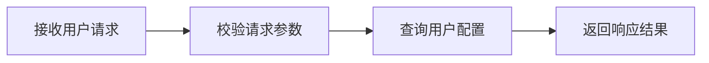
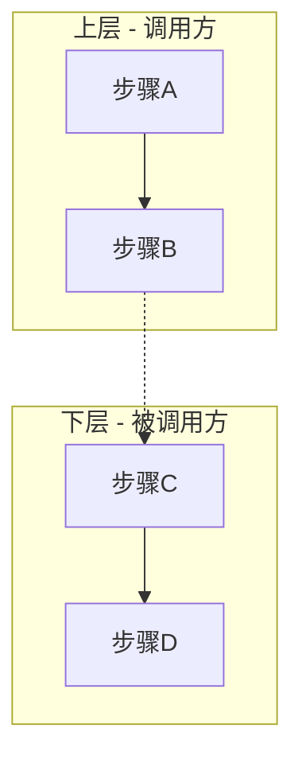
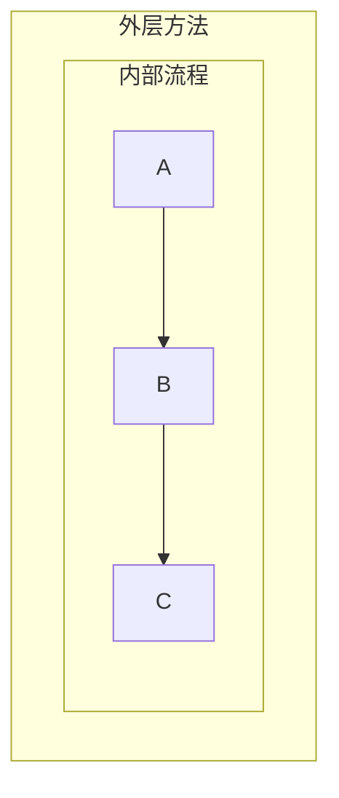
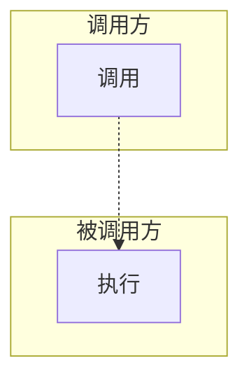

# Mermaid 活动图编写规范

> 本文档定义了团队使用 Mermaid 编写活动图的个性化规范。
> 基础语法请参考 [Mermaid 官方文档](https://mermaid.js.org/syntax/flowchart.html)。
>
> 版本：v1.1.0

---

## 一、节点命名规范

### 1.1 处理节点：动宾短语

**原则**：所有处理节点的文本必须是**动宾短语**——动词描述操作，宾语是操作对象。

```
正确：校验用户信息、解析请求体、保存对话记录
错误：用户信息（纯名词）、处理（纯动词）、系统检查（隐含主语）
```

### 1.2 宾语（操作对象）要求

| 要求 | 说明 | 示例 |
|------|------|------|
| 具体可辨识 | 指向明确的系统实体或数据，不泛指 | `获取用户配置列表` 而非 `获取数据` |
| 与代码域对齐 | 对应代码中的类、表、字段或 API 资源，便于追溯实现 | `创建应用` → `POST /apps`、`更新令牌` → `token.refresh()` |
| 粒度一致 | 同一层级节点的宾语抽象层级保持一致 | 见下方示例 |
| 单一对象 | 一个节点只描述一个动作对一个对象的操作 | `校验参数并转换格式` 应拆为 `校验请求参数` + `转换数据格式` |

**粒度一致示例**：



**反例**（粒度混乱）：`接收请求` → `校验` → `根据 userId 查 config` → `返回`

### 1.3 各节点类型的命名规则

| 节点类型 | 命名规则 | 示例 |
|----------|----------|------|
| 处理节点 | 动宾短语 | `解析请求体` |
| 判断/条件 | 是非问句 | `权限是否合法?` |
| 开始/结束 | 名词短语 | `开始`、`结束` |
| 子流程入口 | 动宾短语 | `执行重试策略` |

---

## 二、层级划分规范

### 2.1 使用 subgraph 区分代码层级

**原则**：不同职责的代码层级必须使用 `subgraph` 明确区分边界。



### 2.2 层级命名格式

| 格式 | 示例 |
|------|------|
| `方法名() - 文件名` | `_prepare_tools() - ReAct.py` |
| `类名.方法名()` | `ToolRepository.search()` |
| `功能描述` | `远程检索流程` |

### 2.3 嵌套层级

内部实现细节使用嵌套 subgraph，建议不超过 2 层：



---

## 三、连接规范

### 3.1 线型约定

| 场景 | 线型 | 语法 |
|------|------|------|
| 同层级顺序执行 | 实线 `-->` | `A --> B` |
| 跨层级调用/返回 | 虚线 `-.->` | `A -.-> B` |
| 条件分支 | 带标签实线 | `A -->\|条件\| B` |

### 3.2 跨层连接位置

跨 subgraph 的连接必须放在所有 subgraph 定义**之后**：



---

## 四、颜色标注规范

| 颜色 | 色值 | 用途 |
|------|------|------|
| 浅绿 | `#90EE90` | 已实现功能 |
| 浅橙 | `#FFE4B5` | TODO/待实现 |
| 浅黄 | `#FFFACD` | 子流程背景 |

**语法**：
```
style NodeId fill:#90EE90
```

---

## 五、常见问题

### 5.1 特殊字符导致解析失败

**问题**：节点文本包含 `/`、`{}`、`()` 等字符时解析失败

**解决**：用双引号包裹

```
错误：A[/search]
正确：A["/search"]
```

### 5.2 节点 ID 使用保留字

**问题**：使用 `End`、`end` 作为节点 ID 导致异常

**解决**：添加前缀

```
错误：End([完成])
正确：PTEnd([完成])
```

### 5.3 跨 subgraph 连接不显示

**检查项**：
1. 连接语句是否放在 subgraph 定义之后
2. 节点 ID 是否在各自 subgraph 中已定义
