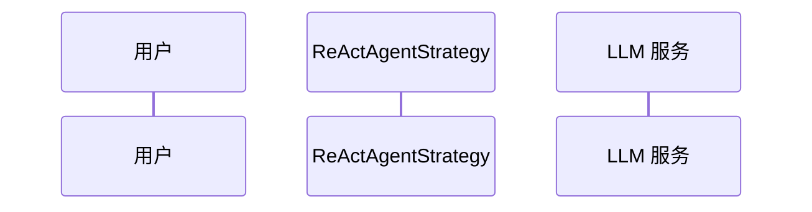
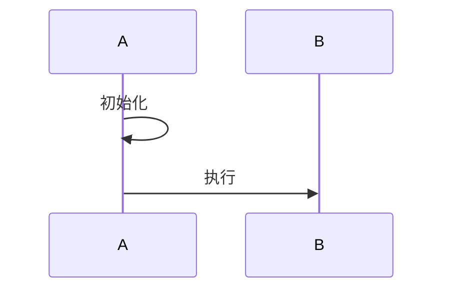
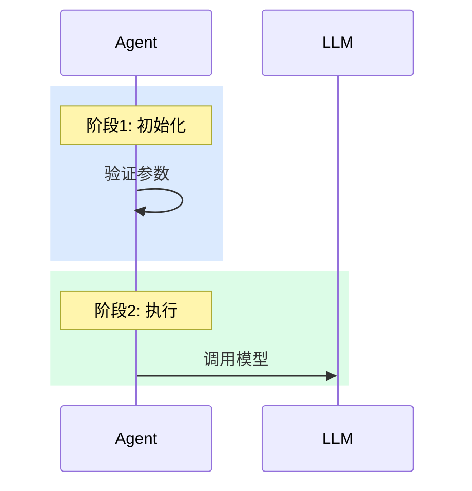
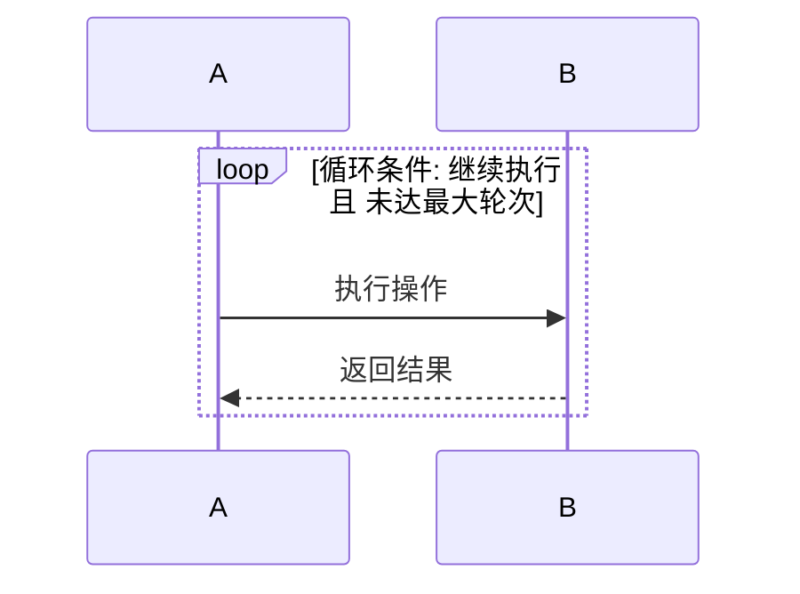
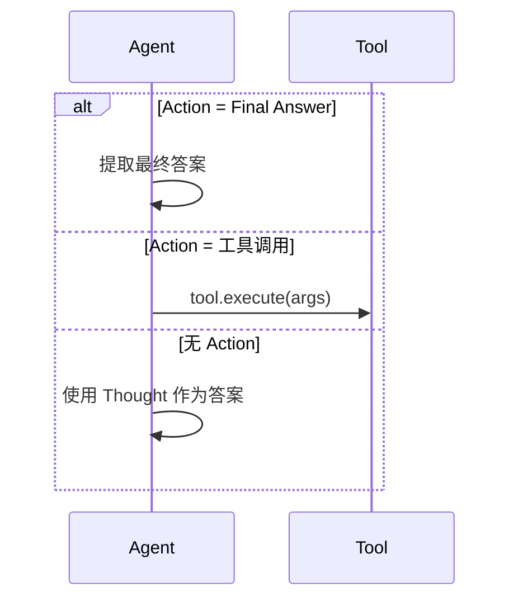
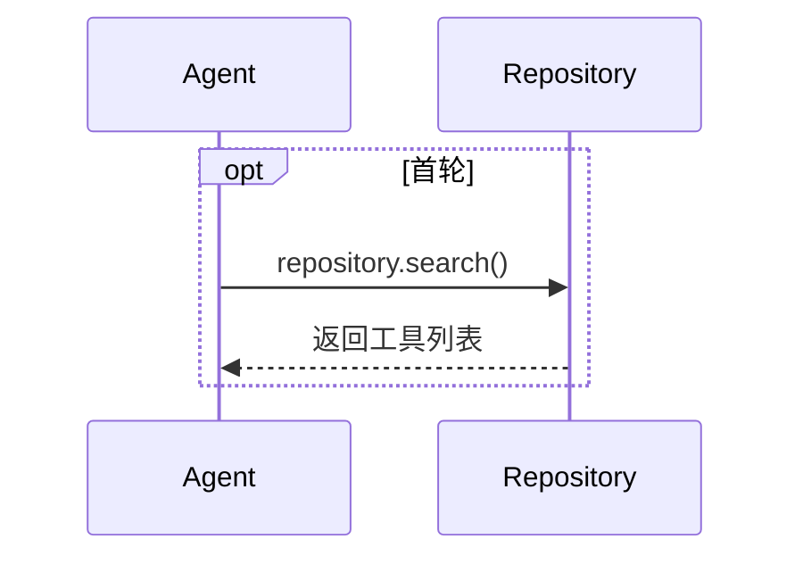
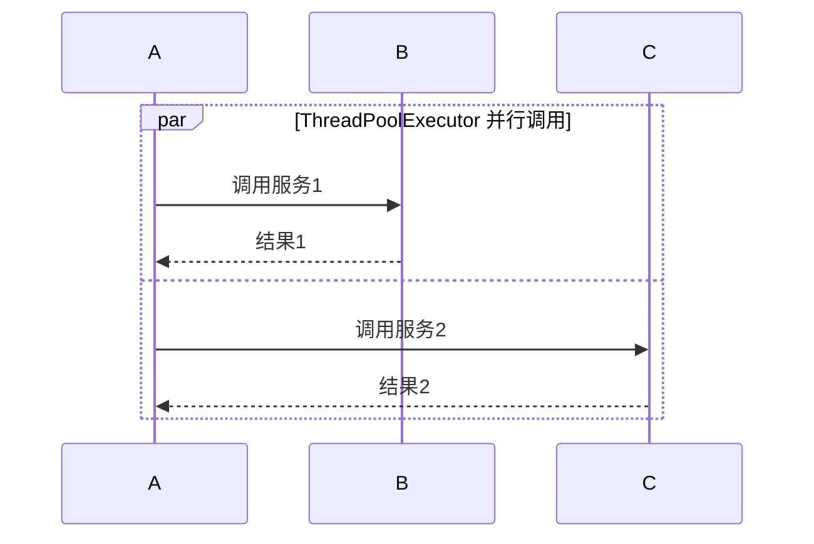
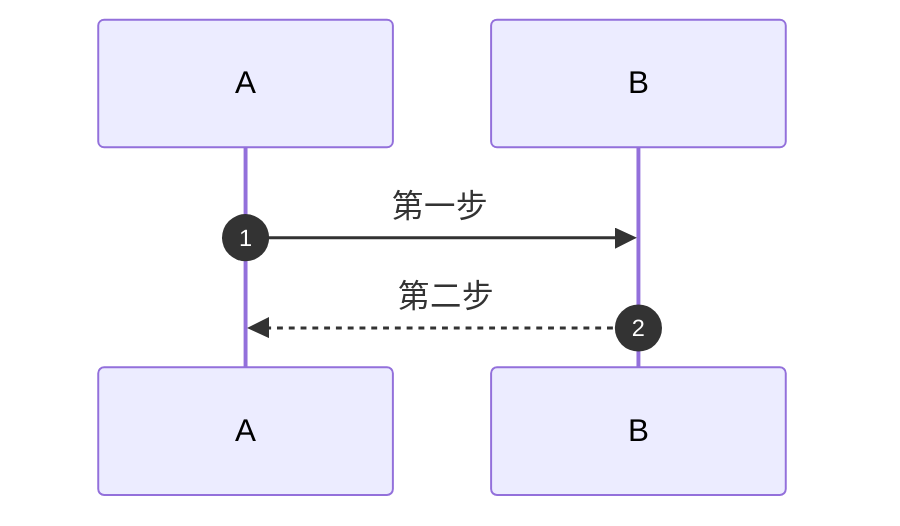

# Mermaid 时序图编写规范

> 本文档定义了团队使用 Mermaid 编写时序图的个性化规范。
> 基础语法请参考 [Mermaid 官方文档](https://mermaid.js.org/syntax/sequenceDiagram.html)。
>
> 版本：v1.0.0

---

## 一、参与者（participant）规范

### 1.1 必须显式声明参与者

**原则**：所有参与者必须在时序图顶部显式声明，控制显示顺序。



### 1.2 参与者命名格式

| 格式 | 示例 |
|------|------|
| `ID as 中文名称` | `participant User as 用户` |
| `ID as 名称<br/>(补充说明)` | `participant Agent as Agent 插件<br/>(ReAct Strategy)` |
| `ID as 类名` | `participant Parser as CotAgentOutputParser` |

**规则**：
- ID 使用简短英文，便于后续引用
- 显示名称使用中文或类名，便于阅读
- 需要补充说明时用 `<br/>` 换行

### 1.3 参与者排列顺序

按调用链从左到右排列：调用方 → 被调用方 → 外部服务。

---

## 二、阶段划分规范

### 2.1 使用注释分隔阶段

**原则**：用 `%% ========== 阶段名 ==========` 注释标记阶段边界。



### 2.2 使用 rect 高亮阶段

不同阶段使用 `rect rgb(...)` 背景色区分：



### 2.3 阶段颜色约定

| 颜色 | RGB 值 | 用途 |
|------|--------|------|
| 浅蓝 | `rgb(219, 234, 254)` | 初始化阶段 |
| 浅紫 | `rgb(237, 233, 254)` | 增强/预处理阶段 |
| 浅绿 | `rgb(220, 252, 231)` | 核心循环/执行阶段 |
| 浅红 | `rgb(254, 226, 226)` | 清理/响应阶段 |

### 2.4 阶段标注

每个 `rect` 块内首行使用 `Note over` 标注阶段名称：

```text
Note over Agent: 阶段1: 初始化
```
---

## 三、消息规范

### 3.1 箭头类型约定

| 场景 | 箭头 | 语法 | 示例 |
|------|------|------|------|
| 同步调用 | 实线实箭头 | `->>` | `A->>B: 调用方法()` |
| 同步返回 | 虚线实箭头 | `-->>` | `B-->>A: 返回结果` |
| 自调用 | 实线实箭头 | `->>` | `A->>A: 内部处理` |

### 3.2 消息文本格式

| 格式 | 适用场景 | 示例 |
|------|----------|------|
| `方法名()` | 明确的方法调用 | `repository.search()` |
| `动词 + 宾语` | 描述性操作 | `返回 Tool 实例列表` |
| `yield 内容` | 流式输出 | `yield text_message(final_answer)` |

---

## 四、流程控制规范

### 4.1 循环（loop）

用于表示重复执行的逻辑，标签写明循环条件：



### 4.2 条件分支（alt/else）

用于表示互斥的执行路径：



### 4.3 可选（opt）

用于表示条件性执行的逻辑块：



### 4.4 并行（par/and）

用于表示并行执行的操作：



---

## 五、注释与说明规范

### 5.1 Note 位置约定

| 语法 | 用途 |
|------|------|
| `Note over A: 文本` | 阶段标题、重要说明 |
| `Note right of A: 文本` | 补充说明、实现细节 |
| `Note over A,B: 文本` | 跨参与者的说明 |

### 5.2 多行 Note

使用 `<br/>` 换行：

```text
Note over Repository: 1. 收集所有工具<br/>2. 按 score 排序<br/>3. 截取 top_k 个
```
---

## 六、编号与图层级规范

### 6.1 启用自动编号

所有时序图必须启用 `autonumber`：



### 6.2 图层级划分

一个文档中应包含多个层级的时序图：

| 层级 | 用途 | 参与者粒度 |
|------|------|------------|
| 核心时序图（组件级） | 展示组件间交互全貌 | 系统/服务级 |
| 整体架构（简化版） | 快速理解主流程 | 核心类级 |
| 详细时序图 | 展示完整实现细节 | 所有相关类 |
| 子流程时序图 | 聚焦特定子流程 | 子流程相关类 |

---

## 七、配套说明规范

### 7.1 时序图后附表格说明

每个核心时序图后应附带表格说明：

```markdown
| 阶段 | 组件交互 | 核心动作 |
|------|----------|----------|
| **初始化** | Agent 内部 | 参数验证、资源初始化 |
| **执行** | Agent ↔ LLM | 推理 + 工具执行 |
```

### 7.2 参与者职责表

```markdown
| 组件 | 说明 | 调用方式 |
|------|------|----------|
| Agent | 策略执行、状态管理 | - |
| LLM | 推理生成 | 通过 Platform |
```

---

## 八、常见问题

### 8.1 特殊字符导致解析失败

**问题**：消息文本包含 `()` 等字符时解析失败

**解决**：确保括号成对出现，或用引号包裹

```text
错误：A->>B: search(query
正确：A->>B: search(query, top_k)
```
### 8.2 rect 嵌套 loop/alt 渲染异常

**问题**：`rect` 内嵌套 `loop` 或 `alt` 时部分渲染器显示异常

**解决**：确保嵌套层级不超过 3 层（rect > loop > alt）

### 8.3 参与者名称过长

**问题**：长名称导致图表过宽

**解决**：ID 用缩写，显示名用 `<br/>` 换行

```text
participant Repo as ToolRepository<br/>Impl
```
