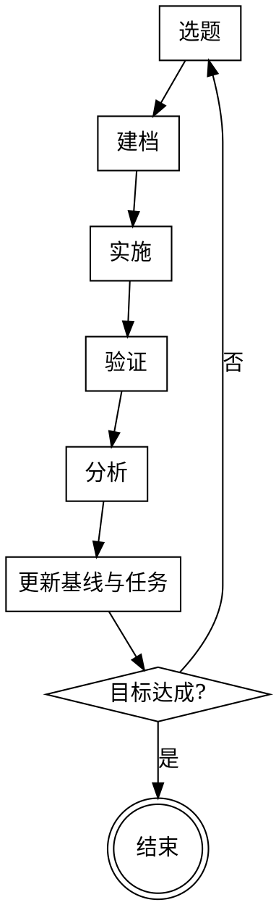

# Proposal Iteration

## Overview

针对单一提案，以量化基线为锚点，逐轮迭代逼近目标的工作模式。每轮迭代是一个完整的科学实验：先写假说，再实施，再验证，再分析偏差，最后更新基线和任务列表。

**核心原则：基线驱动。** 没有更新基线，这轮迭代就没有完成。

---

## 互斥声明

**本 skill 与 openspec 和 superpowers 工作流互斥。**

- 若当前上下文已激活 openspec 流程（如存在 `openspec/` 目录或 `.openspec` 配置），**不使用本 skill**。
- 若用户已显式调用 superpowers skill（brainstorming、writing-plans、TDD 等），**不使用本 skill**。
- 本 skill 是轻量独立模式，不依赖、不组合上述框架。

---

## 何时使用

**使用本 skill 的典型场景：**
- 有一个具体提案（算法改进、参数调优、架构微调），需要多轮迭代验证
- 目标可以量化（如 Sharpe 提升、延迟降低、准确率改善）
- 每轮改动范围小且聚焦，需要与基线对比才能判断有效性
- 需要保留完整的实验历史，便于回溯和复现

**不使用本 skill 的情况：**
- 需求模糊，尚未确定提案方向 → 先用 brainstorming
- 单次完成的任务，无需迭代
- 已在 openspec 或 superpowers 工作流中

---

## 工作区结构

在项目根目录下为每个提案创建独立工作区：

```
<proposal-name>/
├── README.md          ← 提案说明：目标、约束、当前状态
├── GOALS.md           ← 量化目标 + 迭代历史汇总表
├── tasks.md           ← 活跃任务 + backlog
├── baselines/
│   └── current.md     ← 最新基线数据快照（每轮迭代后更新）
├── iterations/
│   └── NNN-short-name.md  ← 每轮迭代报告
└── reports/
    └── (阶段性总结，按需生成)
```

---

## 单轮迭代流程



### 1. 选题

从 `tasks.md` backlog 中选取最高优先级方向。选题必须：
- 对应一个可验证的假说
- 与上一轮迭代的分析结论相关联（或明确说明为何转换方向）

### 2. 建档

在 `iterations/NNN-short-name.md` 写入以下内容后再开始实施：

```markdown
# Iter NNN: <短标题>

## 假说
本轮改动预期带来什么变化？为什么？

## 计划
具体改动内容是什么？

## 预期结果
量化的预期：指标 X 从 A 变为 B。

## 实际结果
（实施后填写）

## 分析
预期与实际的偏差原因。假说是否成立？

## 后续建议
下一轮方向。
```

**不允许跳过建档直接实施。**

### 3. 实施

按计划修改。改动范围尽量小且聚焦，控制单变量。

### 4. 验证

运行与本次改动相关的验证（测试、回测、benchmark 等），记录原始数据。

### 5. 分析

对比 `baselines/current.md` 与本轮实际结果，填写迭代报告的"实际结果"和"分析"两节。

### 6. 更新

完成以下三项，本轮迭代才算结束：

- `baselines/current.md`：用本轮结果替换旧基线
- `GOALS.md`：在迭代历史表中追加本轮记录
- `tasks.md`：关闭已完成任务，补充新发现的方向

---

## 关键文件格式

### `GOALS.md`

```markdown
# 目标与迭代历史

## 量化目标
- 指标 A：从 X 提升到 Y
- 指标 B：不低于 Z

## 迭代历史

| 编号 | 短标题 | 指标 A | 指标 B | 结论 |
|------|--------|--------|--------|------|
| 001  | ...    | ...    | ...    | 假说成立/不成立 |
```

### `baselines/current.md`

```markdown
# 当前基线

**更新于**：Iter NNN（YYYY-MM-DD）

## 关键指标
| 指标 | 值 |
|------|----|
| ...  | ...  |

## 环境快照
（版本、配置、数据范围等足以复现的信息）
```

---

## 常见错误

| 错误 | 后果 | 纠正 |
|------|------|------|
| 实施前未建档 | 无法追溯假说，分析失去依据 | 回到步骤 2，补写后再继续 |
| 改动多个变量 | 无法归因，结论无效 | 拆分为多轮迭代 |
| 未更新基线就开始下一轮 | 对比数据失真，历史断层 | 先完成步骤 6 |
| 假说与上轮分析无关联 | 迭代碎片化，无法积累洞见 | 在选题时显式说明转换原因 |
